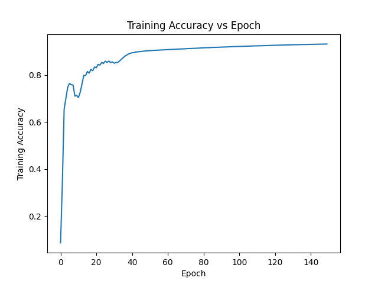
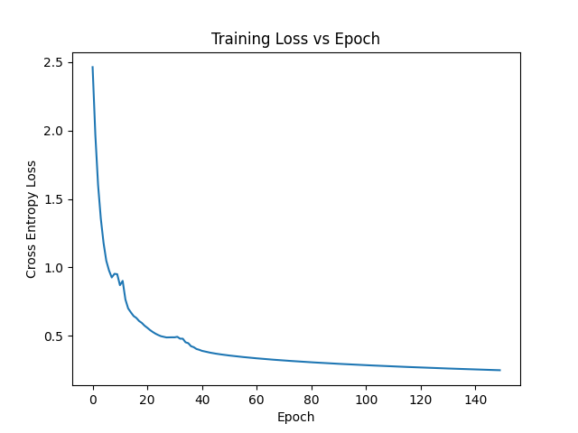

# Neural Network from Scratch
This project implements a fully connected neural network for handwritten digit classification from scratch using NumPy, without relying on deep learning frameworks such as PyTorch or TensorFlow.

The goal of the project was to understand the mathematical foundations of neural networks by implementing forward propagation, backpropagation, and gradient descent manually.

## Dataset
The model is trained on the MNIST handwritten digit dataset, which contains:

* 60,000 training images

* 10,000 test images

* Image size: 28 × 28 grayscale pixels

* 10 output classes (digits 0–9)

* Input pixels are normalized to the range [0,1] to prevent extremely large gradients. Keep in mind that test input data must also be normalized to this range.

## Model Architecture

I stuck to a two-layer fully connected neural network: Input (784) -> Linear Layer (784 -> 256) -> ReLU Activtion -> Linear Layer (256 -> 10) -> Softmax for classification.

## Mathematical Formulation

The network is trained using softmax cross-entropy loss applied to the logits produced by the final linear layer.

The softmax function converts logits into probabilities:

$$
p_j = \frac{e^{z_j}}{\sum_k e^{z_k}}
$$

The cross-entropy loss for a single example is:

$$
L = -z_{y} + \log \sum_{j} e^{z_j}
$$

I used a numerically stable logsumexp() implementation to prevent overflow when exponentiating the logits by subtracting the maximum logit before exponentiation and adding it back afterward.

Combining softmax with cross-entropy yields the gradient:

$$
\frac{\partial L}{\partial z} = p - y
$$

where $p$ represents the predicted probability distribution and $y$ is the one-hot label.

For a linear layer

$$
Z = XW
$$

the gradient with respect to the weights is

$$
dW = X^T dZ
$$

The derivative of the ReLU activation is

$$
dZ = dH \cdot \mathbf{1}[Z > 0]
$$

where $\mathbf{1}[Z > 0]$ is an indicator function equal to 1 when the pre-activation is positive and 0 otherwise.

## Results
Final performance:
* Training accuracy: ~93.09%
* Test accuracy: ~93.39%

## Training Curves

## Project Goals
This project was built to gain a deeper understanding of:
* Gradient-based optimization
* Neural network backpropagation
* Numerical stability in machine learning
* Vectorized linear algebra implementations
* Numpy operations, in general
